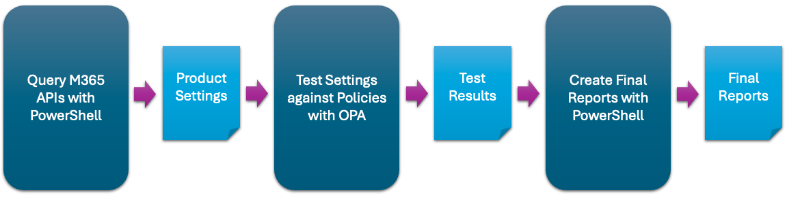

[![GitHub Release][github-release-img]][release]
[![PSGallery Release][psgallery-release-img]][psgallery]
[![CI Pipeline][ci-pipeline-img]][ci-pipeline]
[![Functional Tests][functional-test-img]][functional-test]
[![GitHub License][github-license-img]][license]
[![GitHub Downloads][github-downloads-img]][release]
[![PSGallery Downloads][psgallery-downloads-img]][psgallery]
[![GitHub Issues][github-issues-img]][github-issues]

ScubaGear is a personal project that I developed to assess Microsoft 365 (M365) tenant configurations against the policies described in the Secure Cloud Business Applications ([SCuBA](https://cisa.gov/scuba)) Secure Configuration Baseline [documents](/baselines/README.md).

> [!NOTE]
> This documentation can be read using [GitHub Pages](https://cisagov.github.io/ScubaGear).

## Target Audience

ScubaGear is designed for M365 administrators who want to evaluate their tenant environments against SCuBA Secure Configuration Baselines.

## Overview

ScubaGear uses a three-step process:

- **Step One** - PowerShell queries M365 APIs for configuration settings.
- **Step Two** - Compares these settings against Rego security policies using [Open Policy Agent](https://www.openpolicyagent.org).
- **Step Three** - Reports results as HTML, JSON, and CSV.



## Key Features

### Baseline Security Coverage

SCuBA controls have been mapped to both NIST SP 800-53 and the MITRE ATT&CK framework.

- [Baselines](baselines/README.md)
  - [Microsoft Entra ID](PowerShell/ScubaGear/baselines/aad.md)
  - [Security Suite](PowerShell/ScubaGear/baselines/securitysuite.md)
  - [Exchange Online](PowerShell/ScubaGear/baselines/exo.md)
  - [Power BI](PowerShell/ScubaGear/baselines/powerbi.md)
  - [Power Platform](PowerShell/ScubaGear/baselines/powerplatform.md)
  - [SharePoint](PowerShell/ScubaGear/baselines/sharepoint.md)
  - [Teams](PowerShell/ScubaGear/baselines/teams.md)
- [Removed Policies](PowerShell/ScubaGear/baselines/removedpolicies.md)

### Scuba Configuration UI

The project includes a graphical interface to create and manage YAML configuration files easily.

#### UI Key Features:
- Launch with `Start-ScubaConfigApp`
- Step-by-step setup wizard
- Live YAML preview with validation
- Microsoft Graph integration for selecting users/groups
- Import/export configuration files

> Ideal for users who prefer a visual interface over command-line tools.

### ScubaGear Output

- **HTML Reports**: Interactive, user-friendly compliance reports. [Sample BaselineReports.html](PowerShell/ScubaGear/Sample-Reports/BaselineReports.html)
- **JSON Output**: Structured results for reporting and parsing. [Sample ScubaResults.json](PowerShell/ScubaGear/Sample-Reports/ScubaResults_0d275954-350e-4a22.json)
- **CSV Export**: Spreadsheet-compatible data. [Sample ScubaResults.csv](PowerShell/ScubaGear/Sample-Reports/ScubaResults.csv)

## Getting Started

Before launching **ScubaGear**, ensure dependencies and permissions are correctly configured.

> [!NOTE]
> After installing ScubaGear, use the built-in update functions to keep it current. See [Update Guide](docs/installation/update.md).

### Quick Start Guide

ScubaGear can be run iteratively to establish and refine baselines.

1. **First Run (No Configuration File)**  
   Generates a template of your environment’s current settings.
2. **Subsequent Runs (With Configuration File)**  
   Compares the intended configuration against actual tenant settings.

> [!IMPORTANT]
> Review results thoroughly and update your configuration YAML for risk acceptance, exclusions, or annotations.

### 1. Install ScubaGear

```powershell
# Install from PSGallery
Install-Module -Name ScubaGear
